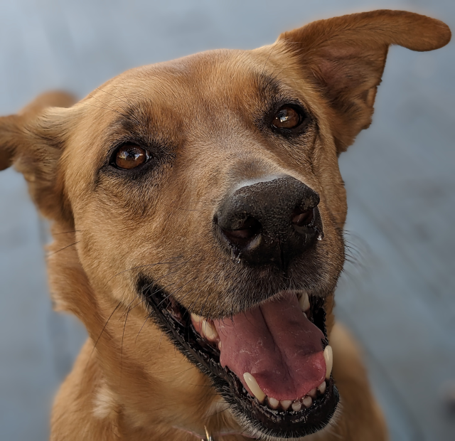

# PET Salon
A [SageMath](https://www.sagemath.org/) package to experiment with Polytope Exchange Transformations (PETs). Currently a work in progress.

## To install

First you need to install the prerequisites. We assume a recent version of [SageMath](https://www.sagemath.org/) has already been installed and is accessible from the command line.

We currently use [frozendict](https://github.com/Marco-Sulla/python-frozendict). To install it run:
```
sage -pip install frozendict
```

To download the software you can run the following from the command line (assuming `git` has been installed):
```
git clone https://github.com/wphooper/pet_salon.git
```
This will create a subdirectory called `pet_salon` and put this software into it. Change into the `pet_salon` directory. You should see 'README.md' and the other files from this repository. To install, from inside this directory run the command:
```
sage -pip install .
```

To reinstall use:
```
sage -pip install --upgrade --force-reinstall .
```

## To test

From the current directory run the command:
```
sage -t pet_salon/*.py
```
To test an individual file run something like:
```
sage -t pet_salon/polyhedra.py
```

## Documentation

A [tutorial](doc/Tutorial.ipynb) is provided.

This software is still very much a work-in-progress and will develop according to research needs. If you would like to use this software, please write to Pat Hooper <whooper@ccny.cuny.edu>.

## Contributors

So far, this software has been written by:

* [W. Patrick Hooper](http://wphooper.com/) (City College of New York and CUNY Graduate Center)

## Acknowledgement

This software was developed by Hooper at a time when he was supported by a grant from the Simon's Foundation and by a PSC-CUNY grant.

## Picture of a PET

Below is Sugar, who has no need for salons.


